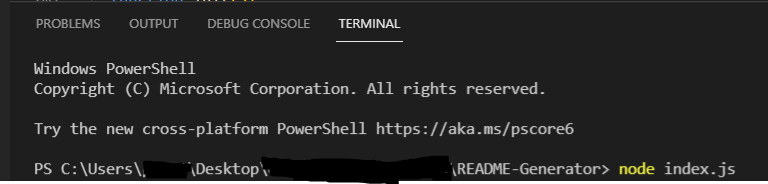
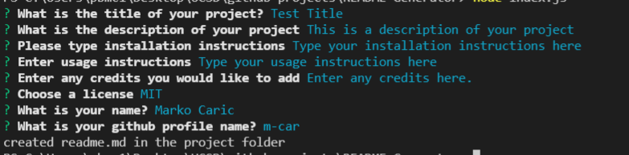
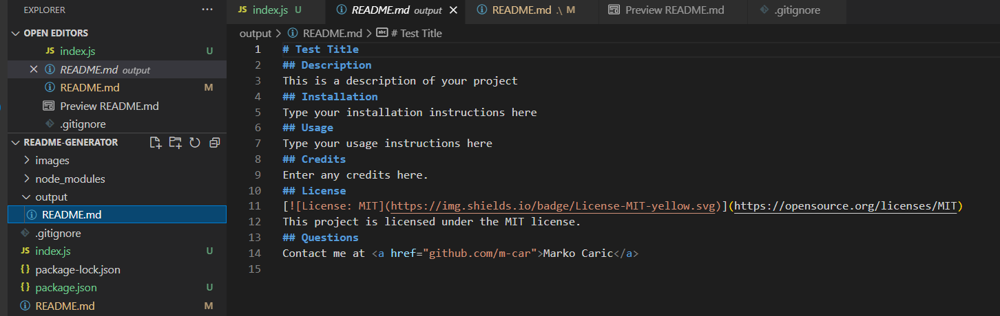

# README Generator

## Description
This is a README generator that uses NPM, inquirer.js and javascript to prompt the user questions, and create a formatted README in the output folder
## Usage
1. Open the console and type "node index.js".

    

2. Follow the prompts on screen.

    

3. A README is generated in the Output folder. 

    

## Installation
- NPM inquirer must be installed via your console. Type "npm i inquirer", as the node_modules is not included. 

